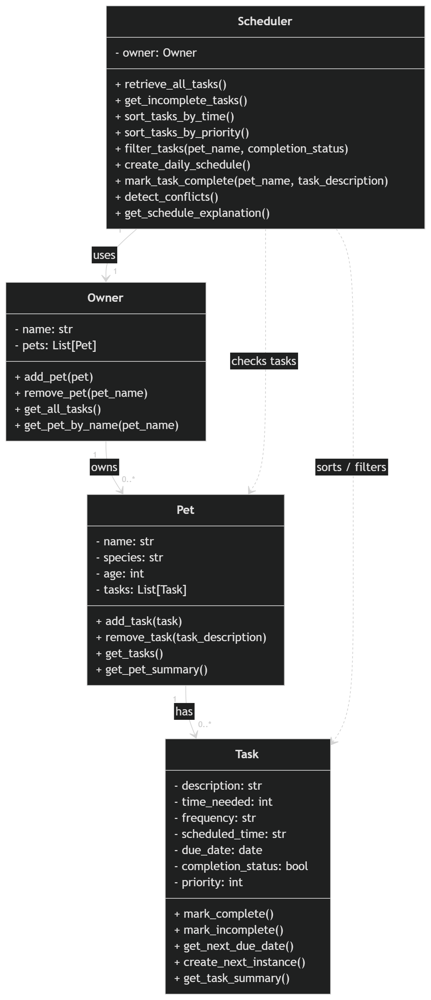

# PawPal+ (Module 2 Project)

You are building **PawPal+**, a Streamlit app that helps a pet owner plan care tasks for their pet.

## Scenario

A busy pet owner needs help staying consistent with pet care. They want an assistant that can:

- Track pet care tasks (walks, feeding, meds, enrichment, grooming, etc.)
- Consider constraints (time available, priority, owner preferences)
- Produce a daily plan and explain why it chose that plan

Your job is to design the system first (UML), then implement the logic in Python, then connect it to the Streamlit UI.

## What you will build

Your final app should:

- Let a user enter basic owner + pet info
- Let a user add/edit tasks (duration + priority at minimum)
- Generate a daily schedule/plan based on constraints and priorities
- Display the plan clearly (and ideally explain the reasoning)
- Include tests for the most important scheduling behaviors

## Getting started

### Setup

```bash
python -m venv .venv
source .venv/bin/activate  # Windows: .venv\Scripts\activate
pip install -r requirements.txt
```

### Suggested workflow

1. Read the scenario carefully and identify requirements and edge cases.
2. Draft a UML diagram (classes, attributes, methods, relationships).
3. Convert UML into Python class stubs (no logic yet).
4. Implement scheduling logic in small increments.
5. Add tests to verify key behaviors.
6. Connect your logic to the Streamlit UI in `app.py`.
7. Refine UML so it matches what you actually built.


## Smart Scheduling 

I expanded this project with smarter scheduling features to make it more practical for a busy pet owner. The scheduler can now sort tasks by time or priority, filter tasks by pet name or completion status, and build a daily plan using incomplete tasks across all pets. This makes it easier to focus on urgent care tasks first while still keeping the schedule organized and readable.

I also added support for recurring tasks. If a task is marked as daily or weekly and it is completed, the system automatically creates the next occurrence with an updated due date. This helps the owner stay consistent with repeated pet care routines such as feeding, walking, and grooming.The scheduler also checks whether two tasks are scheduled at the same time and returns a warning instead of crashing. 

## Testing PawPal+

To run PawPal, run one of the following:

- python -m pytest 
- py -m pytest

The tests validates the following:
- Task completion status updates correctly when a task is marked complete.
- Tasks can be successfully added to a pet’s task list.
- The scheduler correctly sorts tasks based on duration and priority rules.
- Recurring task logic creates a new future task when a daily task is completed.
- Conflict detection identifies tasks scheduled at the same time and returns a warning.

Confidence Level: 4/5

I have given the Confidence Level a 4 out of 5. My test cases are covering normal cases as well as edge cases, but I could be forgetting some other scenarios for more advance testing and confidence. 

## Features

- Add and manage multiple pets under a single owner
- Add, view, and complete pet care tasks
- Smart daily scheduling that prioritizes incomplete tasks
- Task sorting by priority and duration
- Task filtering by pet and completion status
- Reoccuring daily and weekly tasks
- Warns when tasks are scheduled at the same time
- Clear schedule explanation showing why tasks were selected
- Session state for better user experience in Streamlit

## 📸 Demo

<a href="uml_final.png" target="_blank">

</a>

## Reflect and Discuss
The summary should be 5–7 sentences covering:

- The core concept students needed to understand
- Where students are most likely to struggle
- Where AI was helpful vs misleading
- One way they would guide a student without giving the answer

The core concepts students need to understand is how to build a whole system starting from UML to diagram into a working project with a backend and a UI. The students need to understand the differernt components such as Owner, Pet, Task, and Scheduler and now they interact with each other. I think the students might struggle in understanding some parts of this project. I was initially confused what did "Generate documentation smart action to add 1-line docstrings" mean in Phase 2. A lot of this project like the UML diagram are from previous Tinker's or Show's, so I don't think the student should struggle with that. I think that maybe the student might struggling building everyone on top with each other in this project unless they are clear with the prompts. The AI is helping with providing a skeleton and explaining unfamiliar concepts. The AI is great at generating UML diagrams if you are really clear with what you want. The AI could be misleading if it suggests code or solutions that do not match the project requirements. The students should do what they have been doing in the past where they ask details questions without asking something vague. And this would help guide the student without giving them the answer. The students should think in details about the logic of this sysem within this project.  


